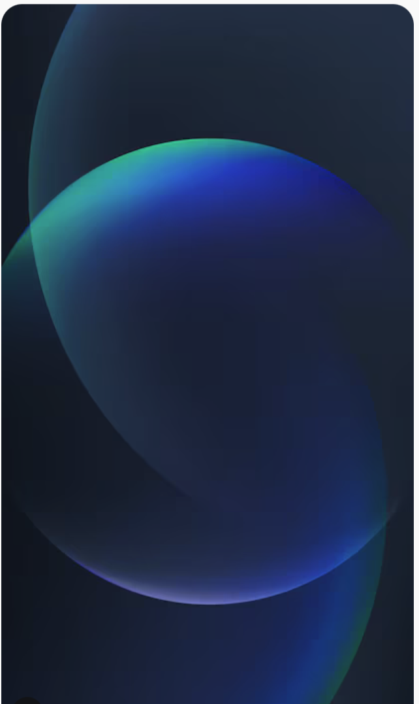

# Design Specification: Bang & Olufsen Voice Controller
**Version:** 1.1  
**Status:** Draft  
**Date:** 2026-04-29  
**Platform:** iOS 26  
**Design Language:** Liquid Glass

---

## Design Philosophy

The B&O Voice Controller should feel like a natural extension of Bang & Olufsen's brand identity — understated luxury, precision, and restraint. The iOS 26 Liquid Glass material system aligns well with this: glass is inherently premium, receding behind content rather than competing with it.

The interface must always feel calm and in control. There is no clutter. When the user speaks, the app responds with quiet confidence. The UI should suggest that the speaker is listening — not that it is waiting.

The fixed dark background (`AppBackground.png`) anchors the visual identity: deep navy with large translucent blue/teal/green orbs. All glass surfaces, buttons, and cards float on top of this image. The result is a consistent, cinematic canvas that does not depend on the user's system wallpaper or light/dark mode setting.

---

## Design Principles

1. **Recede, don't shout** — Glass surfaces let the background breathe. Dark glass pills and frosted cards float over the orb background without competing with it.
2. **One thing at a time** — Each interaction state occupies the full screen. There is no multi-panel complexity in v1.
3. **Voice is the primary control** — Visual elements confirm and guide; they do not replace voice.
4. **Feedback is immediate and exact** — The app always speaks back before acting. The UI reflects this with animated confirmation states.
5. **B&O restraint** — No decorative elements without function. No animation for animation's sake.

---

## Visual Language

### Material: Liquid Glass

Following iOS 26 guidelines, the app uses Liquid Glass as its primary surface material throughout.

| Usage | Material Specification |
|---|---|
| Main listening card | Liquid Glass — thick, frosted, with specular highlight on top edge |
| Speaker selector | Liquid Glass — thin, pill-shaped, horizontally scrollable |
| Volume control track | Liquid Glass — inset, flush with card surface |
| Confirmation sheet | Liquid Glass — bottom sheet, full-width, medium blur radius |
| Tab bar | Liquid Glass — system tab bar, shrinks on scroll per iOS 26 behaviour |
| Status chips (playing, muted) | Liquid Glass — compact pill, tinted with system green / gray |

Liquid Glass surfaces must:
- Refract background content visibly but without distortion that impairs legibility
- Carry a single specular highlight responding to device tilt (motion-driven via CoreMotion)
- Use `UIBlurEffect` with `.systemUltraThinMaterial` for lightweight panels and `.systemMaterial` for primary cards
- Transition with the iOS 26 materialisation animation (gradual modulation of light bending, not a simple fade)

### Button Style

Buttons use a **dark Liquid Glass pill** pattern throughout the app, matching the reference in `ButtonLookAndFeel.png`.

| Property | Value |
|---|---|
| Shape | Fully rounded pill (`radiusPill: 100`) |
| Surface | Dark Liquid Glass — near-black semi-transparent fill (~12% white over black) |
| Border | 0.5 pt hairline, `white.opacity(0.15)` specular highlight |
| Text | SF Pro Text Medium, white, 15 pt |
| Icon | SF Symbol, white, placed leading the label with 6 pt gap |
| Padding | 10 pt vertical, 16 pt horizontal |
| Icon-only variant | Circular pill, 36 × 36 pt, same dark glass surface |

**Button states:**

| State | Treatment |
|---|---|
| Default | Dark glass surface as above |
| Pressed | `scaleEffect(0.95)`, surface brightens ~8% |
| Disabled | Surface opacity 0.4, no interaction |
| Destructive (Cancel) | Same dark pill; label and icon in system red |
| Confirm / Primary | Dark pill with accent gold (`#C8A97E`) icon tint only — label remains white |

Dark glass buttons must:
- Use `.ultraThinMaterial` with a `Color.black.opacity(0.45)` overlay to achieve the near-black frosted look
- Clip to a `Capsule()` shape
- Apply a 0.5 pt `Capsule()` stroke overlay for the specular edge
- Animate press with a spring response 0.3 s, damping 0.7

---

### Layering Model

The interface uses four depth layers, consistent with iOS 26's visual layer model:

```
Layer 4 — Dynamic overlay    Confirmation sheet, error toasts
Layer 3 — Glass controls     Cards, pills, volume track, dark glass buttons
Layer 2 — Glass refraction   Liquid Glass surfaces refracting the orb background
Layer 1 — AppBackground.png  Fixed dark navy / blue-teal orb image, full-bleed
```

Controls float on Layer 3 and never touch the edges of the screen without appropriate safe-area padding.

---

## Typography

| Role | Font | Weight | Size |
|---|---|---|---|
| Speaker name (large) | SF Pro Display | Semibold | 34 pt |
| Now playing title | SF Pro Display | Regular | 22 pt |
| Confirmation read-back | SF Pro Text | Regular | 17 pt |
| Body / list labels | SF Pro Text | Regular | 15 pt |
| Caption / status chips | SF Pro Text | Medium | 12 pt |

- All text uses Dynamic Type; minimum accessibility scale respected
- No custom typefaces — SF Pro is the correct choice for a native iOS 26 app aligning with the B&O brand's own preference for refined, geometric letterforms
- Line length for confirmation read-back capped at ~45 characters per line for comfortable spoken-length reading

---

## Background

The app uses a fixed custom background image (`AppBackground.png`). It features large translucent orbs in deep blue, teal, and green over a near-black navy base — establishing a dark, premium feel that lets Liquid Glass surfaces read clearly on top. The app does **not** use the user's wallpaper or adapt to system light/dark mode at the background layer.



- Use as a full-bleed `Image` behind all content layers
- Asset dimensions: 642 × 1077 px, portrait iPhone, no tiling
- The dark base ensures white button labels and icon-tinted elements remain legible without an additional scrim
- In code: `ZStack` bottom layer, `.ignoresSafeArea()`, `.resizable().scaledToFill()`
- The image is dark enough that `.ultraThinMaterial` glass surfaces appear visibly frosted rather than transparent

---

## Colour

The app uses a **near-neutral, dark-first palette** with a single warm accent, respecting B&O's design vocabulary of black, white, and aluminium tones. The background is always `AppBackground.png`; there is no `--bg-primary` colour token — the image handles that layer.

| Token | Value | Usage |
|---|---|---|
| `--surface-glass` | System `.ultraThinMaterial` + `black.opacity(0.45)` | Dark glass pill surfaces |
| `--surface-card` | System `.systemMaterial` | Speaker card, confirmation sheet |
| `--accent` | `#C8A97E` (warm gold) | Active waveform, confirm icon tint, selected speaker pill |
| `--accent-secondary` | `#A09488` | Muted state, inactive icons |
| `--label-primary` | `#F5F3F0` (near-white) | All primary text — always on dark background |
| `--label-secondary` | `#A09488` | Secondary text, captions, sheet sub-labels |
| `--destructive` | System red | Cancel button label and icon |
| `--success` | System green | Confirmed / playing state chips |
| `--button-border` | `white.opacity(0.15)` | Specular edge on all dark glass pills |

The warm gold accent (`#C8A97E`) is used sparingly: the active waveform animation, the confirm button icon tint, and the currently-selected speaker pill. Everywhere else is neutral white on dark glass.

The app is **dark-mode only** at the visual layer. The fixed background image is inherently dark; light-mode system settings do not change the background or button surfaces. Liquid Glass materials may adapt their refraction slightly in light mode but the overall experience remains dark.

---

## Screen Inventory

### 1. Home — Idle State

The primary screen when the app is open and listening but no command is in progress.

**Layout:**
- Full-bleed background: `AppBackground.png` — dark navy orbs visible through glass layers
- Centre: Large Liquid Glass card (speaker card) — rounded rect, 16 pt corner radius, `systemMaterial` blur
  - Speaker name in SF Pro Display Semibold 34 pt
  - Subtitle: current playback status (e.g. "Playing Jazz Radio" or "Idle")
  - Subtle waveform animation in accent gold when actively listening for a command
- Bottom: Liquid Glass tab-style pill — horizontally scrollable list of available speakers; active speaker highlighted with gold tint
- Top trailing: compact status chip showing connection state (green = online, gray = offline)
- Microphone affordance: not a button — a circular breathing animation beneath the speaker card indicates the app is always listening when foregrounded

**Motion:**
- Speaker card materialises on launch using iOS 26 materialisation
- Waveform pulses smoothly at ~1 Hz when idle-listening; reacts to voice amplitude in real time when the user speaks
- Speaker pill scrolls with momentum; active pill snaps to centre

---

### 2. Command Recognition State

Overlays the home screen while the user is speaking.

**Layout:**
- Speaker card expands slightly (scale 1.02, spring animation)
- Waveform animates at full amplitude, accent gold
- Transcription label appears below the card in SF Pro Text 17 pt, updating live as speech is recognised
- No buttons — the user is speaking; no tap affordance is shown

**Motion:**
- Card scale spring: damping 0.7, response 0.4 s
- Transcription fades in with a 0.15 s opacity animation; text updates with a subtle character-by-character reveal

---

### 3. Confirmation Sheet

Appears after the app has parsed the command and is ready to read back the action.

**Layout:**
- Liquid Glass bottom sheet, slides up from below (standard iOS 26 sheet presentation)
- Sheet height: ~280 pt, fixed (not drag-to-dismiss during confirmation — accidental dismissal must be avoided)
- Content:
  - Small label "About to:" in `--label-secondary`
  - Action read-back in SF Pro Display Regular 22 pt — the exact spoken string (e.g. *"Playing Jazz Radio on Beosound"*)
  - Two buttons, full-width, stacked vertically, using the dark Liquid Glass pill style:
    - **Confirm** — dark glass pill; `checkmark` SF Symbol in accent gold (`#C8A97E`) leading the label "Yes" in white
    - **Cancel** — dark glass pill; `xmark` SF Symbol in system red leading the label "No" in system red
  - Mic indicator: small pill at sheet top — "or say Yes / No"

**Motion:**
- Sheet slides up with spring (damping 0.75, response 0.5 s)
- Confirm button has a soft haptic (`.medium` impact) on tap
- On confirmation: sheet dismisses, action executes, a brief success toast appears

---

### 4. Now Playing State

Replaces the idle speaker card when playback is active.

**Layout:**
- Speaker card gains a secondary Liquid Glass inset panel showing:
  - Track / station name (SF Pro Display Regular 22 pt)
  - Animated playback indicator (three bars, animated in accent gold)
- Volume track: horizontal Liquid Glass slider below the card, flush inset
  - Current volume shown as a label on the trailing end (e.g. "42")
  - Track fills with accent gold from left edge to current value
- Active speaker pill in tab row shows gold tint and a small "playing" dot

---

### 5. Error / Unrecognised State

**Layout:**
- A Liquid Glass toast slides down from the top safe area (not a modal — non-blocking)
- Icon: SF Symbol `exclamationmark.bubble` in `--label-secondary`
- Message text in SF Pro Text 15 pt — the exact error string from the functional spec
- Auto-dismisses after 4 seconds with a fade + slide-up animation
- If the error includes a list (e.g. available favorites), the toast expands to show a compact scrollable list beneath the message

---

### 6. Volume Limit Toast

A lighter variant of the error toast, used specifically when volume is clamped.

- Icon: SF Symbol `speaker.slash` (muted) or `speaker.wave.3` (max)
- Message: *"Beosound is already at maximum volume"*
- Accent tint on icon only — label remains neutral

---

## Iconography

All icons use SF Symbols 6 (iOS 26 baseline). No custom iconography in v1.

| Action | SF Symbol |
|---|---|
| Microphone / listening | `mic.fill` |
| Playing | `waveform` |
| Paused | `pause.fill` |
| Stopped | `stop.fill` |
| Volume | `speaker.wave.2.fill` |
| Muted | `speaker.slash.fill` |
| Favorites | `star.fill` |
| Speaker / device | `hifispeaker.fill` |
| Confirm | `checkmark` |
| Cancel | `xmark` |
| Error | `exclamationmark.bubble` |
| Connection offline | `wifi.slash` |

SF Symbols must use the `.hierarchical` rendering mode where the symbol has multiple layers, allowing the Liquid Glass material to interact naturally with symbol depth.

---

## Interaction & Animation Principles

### Haptics
Use `UIImpactFeedbackGenerator` and `UINotificationFeedbackGenerator` throughout:

| Event | Haptic |
|---|---|
| Command recognised | `.light` impact |
| Confirmation sheet appears | `.medium` impact |
| Action confirmed and sent | `.success` notification |
| Error state | `.error` notification |
| Volume limit reached | `.warning` notification |

### Voice Feedback
The app speaks all confirmation and error strings using `AVSpeechSynthesizer` with the `com.apple.voice.compact.en-US.Samantha` voice (or system default English). Speech rate: 0.5 (AVSpeechUtteranceDefaultSpeechRate). The spoken string always matches the text displayed in the confirmation sheet exactly.

### Transitions
- All screen state changes use shared element transitions anchored on the speaker card
- Sheet presentations use `.sheet` with `presentationDetents([.height(280)])` — no drag handle shown
- Toast animations: slide from top + opacity, spring with damping 0.8

---

## Accessibility

- **VoiceOver:** All interactive elements have `accessibilityLabel` strings. The confirmation sheet announces the read-back string automatically when it appears.
- **Dynamic Type:** All text scales with user's preferred text size. Card height adapts to accommodate larger type.
- **Reduce Motion:** When "Reduce Motion" is enabled, all spring animations are replaced with simple cross-fades at 0.2 s. The waveform animation is replaced with a static pulsing opacity.
- **Increase Contrast:** Liquid Glass blur is reduced; surfaces gain a 1 pt border in `--label-secondary` for legibility.
- **Colour Blind:** The accent gold is not used as the sole differentiator for any state — icon shapes and labels always accompany colour cues.
- **Minimum tap target:** 44 × 44 pt for all tappable elements, per Apple HIG.

---

## Safe Area & Layout

- Respect all iOS 26 safe area insets (top, bottom, leading, trailing)
- Speaker card: horizontally inset 20 pt from screen edges
- Bottom tab pill: sits 12 pt above the home indicator safe area
- Confirmation sheet: extends to the bottom safe area; buttons sit above the home indicator
- No UI elements placed under the Dynamic Island

---

## Screens Summary

| Screen | Trigger | Primary Element |
|---|---|---|
| Home — Idle | App launch / command complete | Speaker card + waveform |
| Command Recognition | Voice detected | Expanded card + live transcription |
| Confirmation Sheet | Command parsed | Bottom sheet + action read-back |
| Now Playing | Playback active | Speaker card + playback panel + volume track |
| Error Toast | Unrecognised / not found / offline | Top toast (non-blocking) |
| Volume Limit Toast | Volume clamped | Top toast (non-blocking) |

---

## Out of Scope for Design (v1)

- Onboarding / first-launch flow (speaker pairing is handled by the B&O app)
- Settings screen
- Light mode variant — the app is intentionally dark-only; system light/dark setting does not alter the background or button surfaces
- iPad layout
- Landscape orientation — portrait only in v1

---

## Design Tokens Reference

```swift
// Background
let appBackground = "AppBackground"   // Image asset name

// Spacing (8-point grid)
let spacing4: CGFloat  = 4
let spacing8: CGFloat  = 8
let spacing12: CGFloat = 12
let spacing16: CGFloat = 16
let spacing20: CGFloat = 20
let spacing24: CGFloat = 24

// Corner radii
let radiusCard: CGFloat  = 20
let radiusPill: CGFloat  = 100  // fully rounded — used for all buttons and chips
let radiusSheet: CGFloat = 16   // system sheet default

// Animation
let springDamping: CGFloat  = 0.75
let springResponse: CGFloat = 0.45

// Materials — card / sheet surfaces
let materialCard = UIBlurEffect(style: .systemMaterial)
let materialThin = UIBlurEffect(style: .systemUltraThinMaterial)

// Button — dark Liquid Glass pill (v1.1)
// Surface = .ultraThinMaterial clipped to Capsule + black overlay
let buttonOverlayColor  = Color.black.opacity(0.45)
let buttonBorderColor   = Color.white.opacity(0.15)
let buttonBorderWidth: CGFloat = 0.5
let buttonPaddingV: CGFloat    = 10
let buttonPaddingH: CGFloat    = 16
let buttonIconGap: CGFloat     = 6
let buttonIconOnlySize: CGFloat = 36

// Colour tokens (dark-only)
let accent          = Color(hex: "#C8A97E")  // warm gold — used sparingly
let accentSecondary = Color(hex: "#A09488")
let labelPrimary    = Color(hex: "#F5F3F0")
let labelSecondary  = Color(hex: "#A09488")
```
